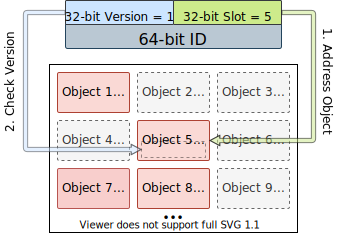
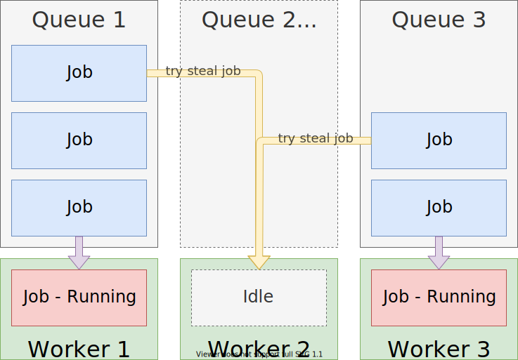
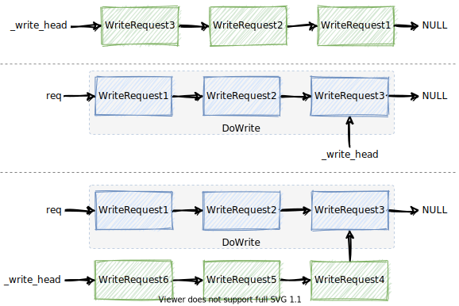
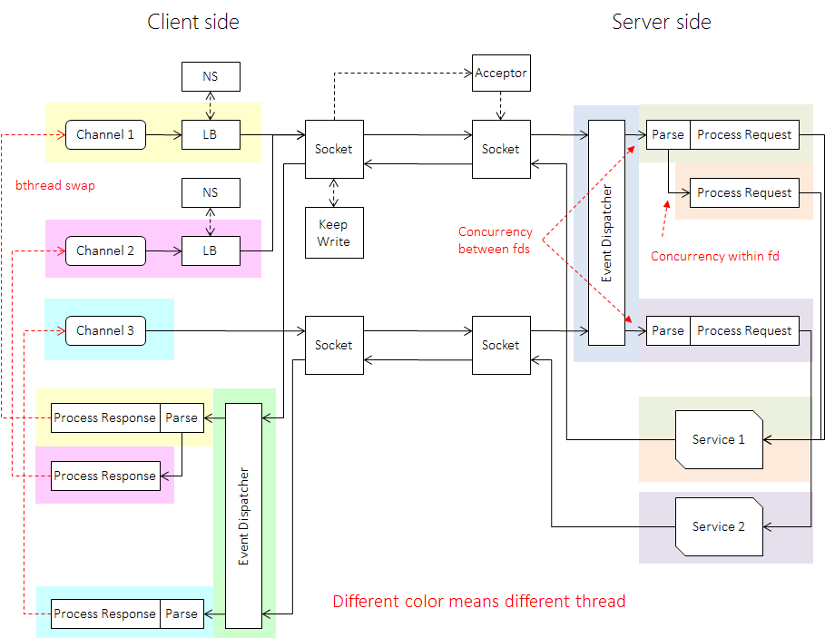

# **bRPC**

**An industrial-grade RPC framework**

https://github.com/apache/incubator-brpc

---

# Core Features

- Memory Management
  * Object Pool
  * ABA Problem
- **M:N** Thread
  * Work Stealing
  * Butex
- Single Connection
  * Wait-free Read/Write

---

# Memory Management

Object Pool & Resource Pool
1. Thread Local First
2. **Never Release**!

```c++
auto obj = get_object<T>();  // get object form thread local pool
                             // or global pool
                             // or construct from thread local memory block
                             // or global memory block

return_object(obj);  // memory is not returned to the system
```

---

# Resource Pool

1. use `resource_id` to address object

```c++
ResourceId<T> slot;  // 32-bit global index, ~4 billion
auto obj = get_resource(&slot);
obj = address_resource(&slot);
return_resource(id);  // return resource to global pool
```

2. use `version` to avoid **ABA problem**

```c++
uint64_t id = (obj->version << 32) | slot;  // 32-bit version + 32-bit slot
obj = address_resource(id & 0xFFFFFFFF);  // safe in multi-thread env
check(obj->version == (id >> 32))  // check version, equal is valid
++obj->version;  // let all id invalid
```

---



---

# **M:N** Thread

- stackful coroutine
  * libcontext: https://github.com/twlostow/libcontext
- worker stealing like Golang
  * avoid coroutine blocking in single thread
- not hook system function
  * call yield when block (socket / lock)
- high-performance and compatible API
  * build coroutine in hundreds of nanoseconds
  * all API can be executed normally in a non-coroutine env

---



---

# pthread-like API

```c++
extern int bthread_start_urgent(bthread_t* __restrict tid,
                                const bthread_attr_t* __restrict attr,
                                void * (*fn)(void*),
                                void* __restrict args);

extern bthread_t bthread_self(void);

extern int bthread_join(bthread_t bt, void** bthread_return);

extern int bthread_yield(void);

...
```

---

# Butex: futex-like semantics

futex:

```c++
// wait if *addr1 == expected
futex(addr1, (FUTEX_WAIT | FUTEX_PRIVATE_FLAG), expected, timeout, NULL, 0);

// wake nwake waiting thread at most
futex(addr1, (FUTEX_WAKE | FUTEX_PRIVATE_FLAG), nwake, NULL, NULL, 0);
```

butex:

```c++
int butex_wait(void* butex, int expected_value, const timespec* abstime);

int butex_wake(void* butex);
```

---

# Single Connection

at most one connection between client and one server in the process.

* better batching
* lower overhead
* **wait-free** write/read

---



---

# Wait-free Read

Parallel on:
- Each connection
- Each parsed request

---

# 

---

# <!--fit--> Thanks

View more details in https://sf-zhou.github.io/#/bRPC
